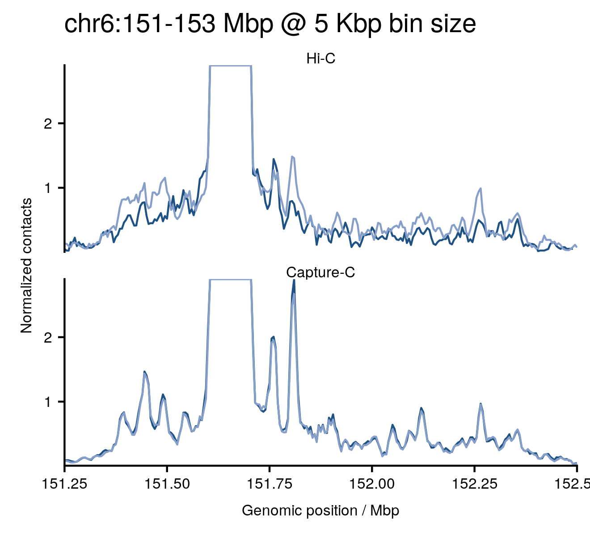
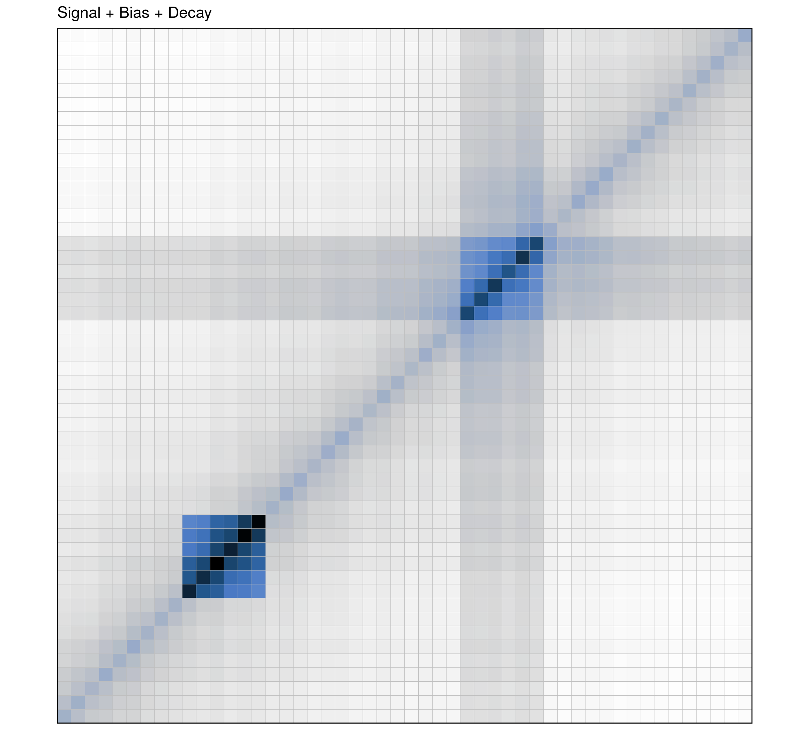

```{r xaringan-themer, include = FALSE}
library("xaringanthemer")
library("fontawesome")

mono_accent(
    base_color = "#143A5C"
)


##solarized_light()
```


```{r setup, include=FALSE}
options(htmltools.dir.version = FALSE)
htmltools::tagList(rmarkdown::html_dependency_font_awesome())
```

count: false
class: inverse, center, middle

</br>
</br>
</br>

# .titan[4DGenome unit]

## 02 / 09 / 2019

</br>

### Enrique (Quique) Vidal</br><i class="fa fa-envelope"></i> enrique.vidal@crg.eu <i class="fa fa-twitter"></i> @qenvio <i class="fa fa-github"></i> qenvio

---
count: false
class: inverse, center, middle

# .gozilla[People]

---

# 4DGenome

.pull-left[
.center[
.theframe[
```{r, echo=FALSE, out.width="90%"}
knitr::include_graphics("images/M_Beato.jpg")
```
]
]
.center[
.theframe[
```{r, echo=FALSE, out.width="90%"}
knitr::include_graphics("images/T_Graff.jpg")
```
]
]
]

.pull-right[
.center[
.theframe[
```{r, echo=FALSE, out.width="90%"}
knitr::include_graphics("images/M_Marti.jpg")
```
]
]
.center[
.theframe[
```{r, echo=FALSE, out.width="90%"}

```
]
]
]

---
count: false
class: inverse, center, middle


# .gozilla[whatever-C]


---

# Chromosome conformation capture

**Dekker, J. et al. (2002)**</br>
*Capturing chromosome conformation*</br>
Science

.center[
```{r, echo=FALSE, out.width="90%"}
knitr::include_graphics("images/crosslink.jpg")
```
]


**Lieberman-Aiden, E. et al. (2009)**</br>
*Comprehensive mapping of long-range interactions reveals folding principles of
the human genome*</br>
Science


---

# Hi-C Matrix: Step by step

.center[
```{r, echo=FALSE, out.width="60%"}

```
]

---

# Territories, compartments, domains, loops

.center[
```{r, echo=FALSE, out.width="70%"}

```
]


---

# Capture-C: Contact matrices

.center[
```{r, echo=FALSE, out.width="75%"}

```
]

---
count: false

# Capture-C: Contact matrices

.center[
```{r, echo=FALSE, out.width="75%"}

```
]

---

# Capture-C: Contact profile

.center[
```{r, echo=FALSE, out.width="75%"}

```
]

---
count: false

# Capture-C: Contact profile

.center[
```{r, echo=FALSE, out.width="75%"}

```
]


---

# 4C

.center[
```{r, echo=FALSE, out.width="70%"}

```
]


---
count: false
class: inverse, center, middle

# .gozilla[Data production]

---

# Samples produced and processed

.center[
```{r, echo=FALSE, out.width="75%"}

```
]


---
count: false
class: inverse, center, middle

# .gozilla[Challenges]

---
count: false
class: inverse

# Challenges

--

## &emsp; 1. Sequencing overflow

---

# Sequencing overflow

### Over 1,000 samples processed

--
## &emsp; Metadata

--
## &emsp; Automatization

--
## &emsp; Cluster (storage and jobs)

--
## &emsp; Exploration and visualization aids

---

# Parallel sequencing lives

.center[
.theframe[
```{r, echo=FALSE, out.width="100%"}

```
]
]

---

# Parallel sequencing lives


.center[
.theframe[
```{r, echo=FALSE, out.width="90%"}

```
]
]


---

# HIsee: Metadata

.center[
.theframe[
```{r, echo=FALSE, out.width="90%"}

```
]
]

---

# HIsee: Quality control

.center[
.theframe[
```{r, echo=FALSE, out.width="90%"}

```
]
]

---

# HIsee: Contact matrices

.center[
.theframe[
```{r, echo=FALSE, out.width="90%"}

```
]
]

---

# HIsee: Whole chromosome

.center[
.theframe[
```{r, echo=FALSE, out.width="90%"}

```
]
]

---

# HIsee: Smoothing!

.center[
.theframe[
```{r, echo=FALSE, out.width="90%"}

```
]
]

---

# Virual 4C

.center[
.theframe[
```{r, echo=FALSE, out.width="90%"}

```
]
]


---
count: false
class: inverse

# Challenges

## &emsp; 1. Sequencing overflow

## &emsp; 2. Reproducibility

---

# Reproducibility

--

## &emsp; Biases

--

## &emsp; Aberrant karyotypes

--

## &emsp; Incomplete designs

--

## &emsp; Computational resources


---

# Biases

.center[
```{r, echo=FALSE, out.width="70%"}
knitr::include_graphics("images/toy_signal.png")
```
]

---
count: false

# Biases

.center[
```{r, echo=FALSE, out.width="70%"}
knitr::include_graphics("images/toy_signal_and_bias.png")
```
]

---
count: false

# Biases

.center[
```{r, echo=FALSE, out.width="70%"}

```
]


---
count: false

# Biases

.center[
```{r, echo=FALSE, out.width="70%"}
knitr::include_graphics("images/toy_simulated.png")
```
]

---

# Aberrant karyotypes

.center[
```{r, echo=FALSE, out.width="70%"}
knitr::include_graphics("images/hic_copy-number_only-raw.png")
```
]

---

# Inclomplete designs

.center[
```{r, echo=FALSE, out.width="70%"}

```
]


---

# A model-based approach to bias removal

.center[
```{r, echo=FALSE, out.width="60%"}
knitr::include_graphics("images/hic_totals_filtered.png")
```
]

---
count: false

# A model-based approach to bias removal

.center[
```{r, echo=FALSE, out.width="60%"}
knitr::include_graphics("images/hic_totals_smooth_filtered.png")
```
]

---

# A model-based approach to bias removal

<br>

.center[
.theframe[
```{r, echo=FALSE, out.width="90%"}

```
]
]

</br>
.center[
### <i class="fa fa-github"></i> qenvio/dryhic
]

---

# OneD vs. the world

.center[
```{r, echo=FALSE, out.width="70%"}

```
]


---

# OneD is thrifty

--

.pull-left[
.center[
```{r, echo=FALSE, out.width="100%"}

```
]
]

--

.pull-right[
.center[
```{r, echo=FALSE, out.width="100%"}
knitr::include_graphics("images/hic_resolution_projection_filtered.png")
```
]
]


---

# OneD is fast

.center[
```{r, echo=FALSE, out.width="70%"}

```
]


---
count: false
class: inverse

# Challenges

## &emsp; 1. Sequencing overflow

## &emsp; 2. Reproducibility

## &emsp; 3. Data &#8594; Info &#8594; Knowledge

---

# The inner life of TADs

--
.pull-left[
.center[
```{r, echo=FALSE, out.width="100%"}

```
]
]

--
.pull-right[
.center[
```{r, echo=FALSE, out.width="100%"}

```
]
]

---

# The inner life of TADs

.pull-left[
.center[
```{r, echo=FALSE, out.width="100%"}

```
]
]

.pull-right[
.center[
```{r, echo=FALSE, out.width="100%"}

```
]
]

---

# The inner life of TADs

.pull-left[
.center[
```{r, echo=FALSE, out.width="100%"}

```
]
]

.pull-right[
.center[
```{r, echo=FALSE, out.width="100%"}
knitr::include_graphics("images/intratad_linearmodel_foldchange_onebatch.png")
```
]
]


---

# Hormone-control regions

.center[
.theframe[
```{r, echo=FALSE, out.width="100%"}

```
]
]

---

# Hormone-control regions

.center[
.theframe[
```{r, echo=FALSE, out.width="70%"}

```
]
]

---

# 3D genome and gene regulation

.center[
.theframe[
```{r, echo=FALSE, out.width="70%"}

```
]
]

---

# 3D genome and gene regulation

.center[
.theframe[
```{r, echo=FALSE, out.width="100%"}

```
]
]


---
count: false
class: inverse

# Challenges

## &emsp; 1. Sequencing overflow

## &emsp; 2. Reproducibility

## &emsp; 3. Data &#8594; Info &#8594; Knowledge

## &emsp; 4. Be in the middle


---

# Collaborations and scientific production


.center[
```{r, echo=FALSE, out.width="70%"}

```
]


---
count: false
class: inverse, center, middle

# .gozilla[To-Do]

---

# Consensus

--

## &emsp; Quality control

--

## &emsp; Data formats and storage

--

## &emsp; Callers (A/B, TAD, loop ...)


---

# So ...

<br>

<center>
<blockquote class="twitter-tweet"><p lang="en" dir="ltr">A DNA sequencer is a machine that automates the generation of batch effects.</p>&mdash; Lior Pachter (@lpachter) <a href="https://twitter.com/lpachter/status/1161934792335560704?ref_src=twsrc%5Etfw">August 15, 2019</a></blockquote> <script async src="https://platform.twitter.com/widgets.js" charset="utf-8"></script>
</center>
<script async src="https://platform.twitter.com/widgets.js" charset="utf-8"></script>


---
count: false 

# So ... do we have batch effect? ...

<br>

<center>
<blockquote class="twitter-tweet"><p lang="en" dir="ltr">A DNA sequencer is a machine that automates the generation of batch effects.</p>&mdash; Lior Pachter (@lpachter) <a href="https://twitter.com/lpachter/status/1161934792335560704?ref_src=twsrc%5Etfw">August 15, 2019</a></blockquote> <script async src="https://platform.twitter.com/widgets.js" charset="utf-8"></script>
</center>
<script async src="https://platform.twitter.com/widgets.js" charset="utf-8"></script>


---

# So ... do we have batch effect? ... Of course


.center[
```{r, echo=FALSE, out.width="60%"}
knitr::include_graphics("images/intratad_batch_pca_raw.png")
```
]

---
count: false

# OK ... Can we fix it?

.center[
```{r, echo=FALSE, out.width="60%"}
knitr::include_graphics("images/intratad_batch_pca_raw.png")
```
]

---

# OK ... Can we fix it? ... It depends


.center[
```{r, echo=FALSE, out.width="60%"}

```
]

---

# Data release

--

<br>

## Do you remember we have generated +500 samples?

--

<br>

## Well ... now we have to make them public


---
class: inverse, center


# .titan[4DGenome unit]

--

</br>
 

# It's about C technologies


--

</br>


# Ask us

--

 
## (Before we leave)


---
count: false

# ROC and AUC normal karyotypes

.center[
```{r, echo=FALSE, out.width="70%"}
knitr::include_graphics("images/benchmark_values_rocs_normals.png")
```
]

---
count: false

# PRC and AUC

.center[
```{r, echo=FALSE, out.width="70%"}
knitr::include_graphics("images/benchmark_values_prcs_all.png")
```
]

