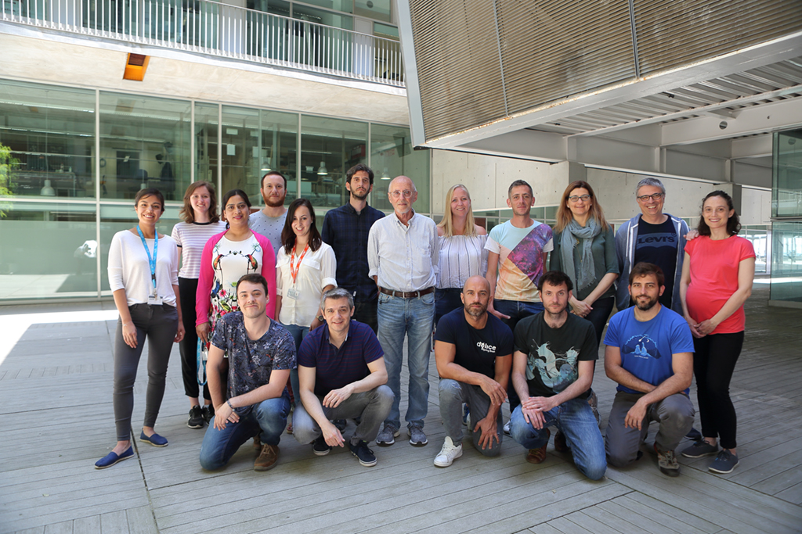
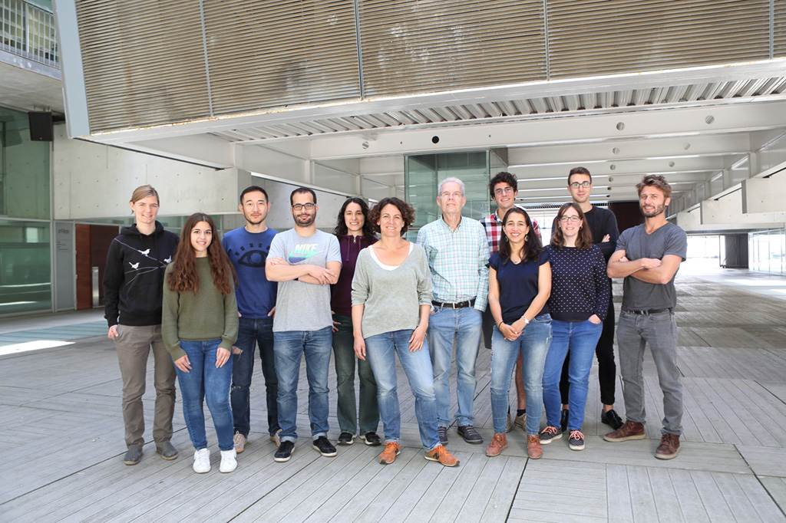

```{r xaringan-themer, include = FALSE}
library("xaringanthemer")
mono_accent(
    base_color = "#143A5C"
	)
#solarized_light()
```


```{r setup, include=FALSE}
options(htmltools.dir.version = FALSE)
htmltools::tagList(rmarkdown::html_dependency_font_awesome())
```

count: false
class: inverse, center, middle

</br>
</br>
</br>
</br>

# Simple statistical models for complex 3D genome data

</br>

## Barcelona, 1 February 2019

</br>

### Enrique (Quique) Vidal</br><i class="fa fa-envelope"></i> enrique.vidal@crg.eu</br><i class="fa fa-twitter"></i> @qenvio <i class="fa fa-github"></i> qenvio


---

# 4DGenome

.pull-left[
.center[
.theframe[
```{r, echo=FALSE, out.width="90%"}

```
]
]
.center[
.theframe[
```{r, echo=FALSE, out.width="90%"}

```
]
]
]

.pull-right[
.center[
.theframe[
```{r, echo=FALSE, out.width="90%"}

```
]
]
.center[
.theframe[
```{r, echo=FALSE, out.width="90%"}
knitr::include_graphics("images/G_Filion.jpg")
```
]
]
]


---
class: inverse, center, middle
count: false

# Motivation

---

# Genome structure is not random

.center[
```{r, echo=FALSE, out.width="55%"}
knitr::include_graphics("images/cells.png")
```
]

---

# Chromosome conformation capture

**Dekker, J. et al. (2002)**</br>
*Capturing chromosome conformation*</br>
Science

.center[
```{r, echo=FALSE, out.width="90%"}
knitr::include_graphics("images/crosslink.jpg")
```
]


**Lieberman-Aiden, E. et al. (2009)**</br>
*Comprehensive mapping of long-range interactions reveals folding principles of
the human genome*</br>
Science


---
class: inverse, center, middle
count: false

# What does Hi-C offer?

---

# Territories, compartments, domains, loops

.center[
```{r, echo=FALSE, out.width="70%"}
knitr::include_graphics("images/hic.png")
```
]

---
class: inverse, center, middle
count: false

# Biases

---

# Genomic features affect Hi-C

.center[
```{r, echo=FALSE, out.width="70%"}
knitr::include_graphics("images/yaffe.png")
```
]

.tiny[
**Yaffe, E. and Tanay, A. (2011)**</br>
*Probabilistic modeling of Hi-C contact maps eliminates systematic biases to
characterize global chromosomal architecture*</br>
Nature genetics
]


---

# Illustrating biases

.pull-left[
.center[
```{r, echo=FALSE, out.width="100%"}
knitr::include_graphics("images/toy_signal.png")
```
]
]

--
.pull-right[
.center[
```{r, echo=FALSE, out.width="100%"}

```
]
]

---
count: false

# Illustrating biases

.pull-left[
.center[
```{r, echo=FALSE, out.width="100%"}
knitr::include_graphics("images/toy_signal.png")
```
]
]

.pull-right[
.center[
```{r, echo=FALSE, out.width="100%"}
knitr::include_graphics("images/toy_bias.png")
```
]
]

---
count: false

# Illustrating biases

.pull-left[
.center[
```{r, echo=FALSE, out.width="100%"}

```
]
]

--
.pull-right[
.center[
```{r, echo=FALSE, out.width="100%"}
knitr::include_graphics("images/hic_distance_decay.png")
```
]
]

---
count: false

# Illustrating biases

.pull-left[
.center[
```{r, echo=FALSE, out.width="100%"}

```
]
]

.pull-right[
.center[
```{r, echo=FALSE, out.width="100%"}

```
]
]

---
count: false

# Illustrating biases

.pull-left[
.center[
```{r, echo=FALSE, out.width="100%"}
knitr::include_graphics("images/toy_signal_and_bias_and_decay.png")
```
]
]

--
.pull-right[
.center[
```{r, echo=FALSE, out.width="100%"}
knitr::include_graphics("images/toy_simulated.png")
```
]
]

---
count: false

# Illustrating biases

.pull-left[
.center[
```{r, echo=FALSE, out.width="100%"}
knitr::include_graphics("images/toy_signal.png")
```
]
]

.pull-right[
.center[
```{r, echo=FALSE, out.width="100%"}
knitr::include_graphics("images/toy_simulated.png")
```
]
]

---
class: inverse, center, middle
count: false

# Previous approaches

---

.pull-left[

.center[

# HiCNorm

### Explicit model of biases

### Regression model

### All matrix entries

]

</br>

.tiny[
**Yaffe, E. and Tanay, A. (2011)**</br>
*Probabilistic modeling of Hi-C contact maps eliminates systematic biases to
characterize global chromosomal architecture*</br>
Nature genetics
]

.tiny[
**Hu, M. et al. (2012)**</br>
*HiCNorm: removing biases in Hi-C data via Poisson regression*</br>
Bioinformatics
]

]


.pull-righ[

.center[

# ICE

### Implicit correction

### Matrix balancing

### Equal visibility

]

</br>

.tiny[
**Imakaev, M. et al. (2012)**</br>
*Iterative correction of Hi-C data reveals hallmarks of chromosome organization*</br>
Nature methods

]

]

---

# In action

.center[
```{r, echo=FALSE, out.width="70%"}
knitr::include_graphics("images/toy_previous.png")
```
]


---

.pull-left[

.center[

# HiCNorm

]

</br>

### &nbsp;  &nbsp;  &nbsp;  &nbsp; &#x2713; fewer artifacts

### &nbsp;  &nbsp;  &nbsp;  &nbsp; &#x274C; very slow

### &nbsp;  &nbsp;  &nbsp;  &nbsp; &#x274C; no high resolution


]

.pull-righ[

.center[

# ICE

]

</br>

### &nbsp;  &nbsp;  &nbsp;  &nbsp; &#x274C; more artifacts

### &nbsp;  &nbsp;  &nbsp;  &nbsp; &#x2713; fast

### &nbsp;  &nbsp;  &nbsp;  &nbsp; &#x2713; high resolution

</br>

]

--
.center[

### &#x274C; aberrant karyotypes

]


---
class: inverse
count: false

# Wish list

</br>
</br>

--
### &#9825; Suitable aberrant karyotypes

</br>

--
### &#9825; As good as existing

</br>

--
### &#9825; Fast and scalable (high resolution)


---

# 2D &#8594; 1D

--
.center[
```{r, echo=FALSE, out.width="70%"}

```
]

---
count: false

# 2D &#8594; 1D vs. genomic features

.center[
```{r, echo=FALSE, out.width="60%"}

```
]

---
count: false

# 2D &#8594; 1D vs. genomic features


.center[
```{r, echo=FALSE, out.width="60%"}

```
]

---

# OneD model

.pull-left[
.center[
```{r, echo=FALSE, out.width="100%"}

```
]
]

.pull-righ[
</br>
$$t_i = \sum_{j}^{n}{x_{i,j}} \sim NB(\lambda_i, \theta)$$
$$log\left(\lambda_i\right) \propto \sum_{k}{f_k(x_k)}$$
$$\lambda_{i}' = \frac{\lambda_i}{\sum_i^n{\lambda_j}/n}$$
$$\hat{x}_{i,j} = \frac{x_{i,j}}{\sqrt{\lambda_{i}'\lambda_{j}'}}$$
]

---
count: false

# OneD model

.pull-left[
.center[
```{r, echo=FALSE, out.width="100%"}

```
]
]

.pull-righ[
</br>
$$t_i = \sum_{j}^{n}{x_{i,j}} \sim NB(\lambda_i, \theta)$$
$$log\left(\lambda_i\right) \propto \sum_{k}{f_k(x_k)}$$
$$\lambda_{i}' = \frac{\lambda_i}{\sum_i^n{\lambda_j}/n}$$
$$\hat{x}_{i,j} = \frac{x_{i,j}}{\sqrt{\lambda_{i}'\lambda_{j}'}}$$
]


---
count: false

# OneD model

.pull-left[
.center[
```{r, echo=FALSE, out.width="100%"}

```
]
]

.pull-righ[
</br>
$$t_i = \sum_{j}^{n}{x_{i,j}} \sim NB(\lambda_i, \theta)$$
$$log\left(\lambda_i\right) \propto \sum_{k}{f_k(x_k)}$$
$$\lambda_{i}' = \frac{\lambda_i}{\sum_i^n{\lambda_j}/n}$$
$$\hat{x}_{i,j} = \frac{x_{i,j}}{\sqrt{\lambda_{i}'\lambda_{j}'}}$$
]

---

# OneD in action

.center[
```{r, echo=FALSE, out.width="70%"}
knitr::include_graphics("images/toy_all.png")
```
]


---
class: inverse, center, middle
count: false

# OneD performance

---

# Benchmark strategy

</br>

### Compare methods

Previous, **OneD** and doing nothing (raw)


### Undesired variability

Different protocols (restriction enzyme, in-situ / diluted, lab, etc ...)


### Relevant variability

Different cell types

---

# Pair-wise comparison

.center[
```{r, echo=FALSE, out.width="70%"}

```
]

---
count: false

# Pair-wise comparison

.center[
```{r, echo=FALSE, out.width="70%"}

```
]

---

# ROC and AUC

.center[
```{r, echo=FALSE, out.width="70%"}

```

]

---
count: false

# ROC and AUC

.center[
```{r, echo=FALSE, out.width="70%"}

```
]

---
count: false

# ROC and AUC

.center[
```{r, echo=FALSE, out.width="70%"}
knitr::include_graphics("images/benchmark_values_rocs_all.png")
```
]


---

# Speed and resolution

.center[
```{r, echo=FALSE, out.width="70%"}

```
]

---
count:false

# Speed and resolution

.center[
```{r, echo=FALSE, out.width="70%"}
knitr::include_graphics("images/reso_times.png")
```
]

---
class: inverse
count: false

# Wish list

</br>
</br>

### &#9825; Suitable aberrant karyotypes &#x2713;

</br>

### &#9825; ~~As good as~~ Better than existing &#x2713;

</br>

### &#9825; Fast and scalable (high resolution) &#x2713;


---

# OneD availability

### R package

https://github.com/qenvio/dryhic


### Paper

**Vidal, E. et al. (2018)**

*OneD: increasing reproducibility of Hi-C samples with abnormal karyotypes*

Nucleic acids research

https://doi.org/10.1093/nar/gky064

---
count: false
class: inverse, center, middle

# Exploiting the model
## Less is more


---

# Use only a subset

.pull-left[
.center[
```{r, echo=FALSE, out.width="100%"}

```
]
]


---
count: false

# Use only a subset

.pull-left[
.center[
```{r, echo=FALSE, out.width="100%"}

```
]
]

--

.pull-right[
.center[
```{r, echo=FALSE, out.width="100%"}

```
]
]

---
count: false

# Use only a subset

.pull-left[
.center[
```{r, echo=FALSE, out.width="100%"}

```
]
]


.pull-right[
.center[
```{r, echo=FALSE, out.width="100%"}

```
]
]

---
count: false

# Use only a subset

.pull-left[
.center[
```{r, echo=FALSE, out.width="100%"}

```
]
]


.pull-right[
.center[
```{r, echo=FALSE, out.width="100%"}

```
]
]

---
count: false

# Use only a subset

.pull-left[
.center[
```{r, echo=FALSE, out.width="100%"}

```
]
]


.pull-right[
.center[
```{r, echo=FALSE, out.width="100%"}
knitr::include_graphics("images/hic_totals_subsample_correlation_filtered.png")
```
]
]

---
count: false

# Use only a subset

.pull-left[
.center[
```{r, echo=FALSE, out.width="100%"}

```
]
]


.pull-right[
.center[
```{r, echo=FALSE, out.width="100%"}
knitr::include_graphics("images/hic_totals_subsample_correlation_filtered.png")
```
]
]

--

.center[
</br>
### Incomplete designs &#x2713;
]

---
count: false
class: inverse, center, middle

# Exploiting the model
## Resolution-free


---

# Fit once, project everywhere

.pull-left[
.center[
```{r, echo=FALSE, out.width="100%"}

```
]
]

--

.pull-right[
.center[
```{r, echo=FALSE, out.width="100%"}

```
]
]

---
count: false

# Fit once, project everywhere

.pull-left[
.center[
```{r, echo=FALSE, out.width="100%"}

```
]
]

.pull-right[
.center[
```{r, echo=FALSE, out.width="100%"}

```
]
]

---
count: false

# Fit once, project everywhere

.pull-left[
.center[
```{r, echo=FALSE, out.width="100%"}

```
]
]

.pull-right[
.center[
```{r, echo=FALSE, out.width="100%"}

```
]
]

--

.center[
</br>
### Effortless bias removal at high resolution &#x2713;
]


---
count: false
class: inverse, center, middle

# Exploiting the model
## Quality control

---

# Model metrics as quality control

.center[
```{r, echo=FALSE, out.width="60%"}

```
]


---
class: inverse
count: false

# Grand summary

</br>

--
### Hi-C data present biases

--

### Use explicit modeling to reduce them

--

### Exploit the model!

--

</br>
.center[
### OneD: <i class="fa fa-github"></i> qenvio/dryhic
]


---
count: false

# Total contacts &#8594; copy number

.pull-left[
.center[
```{r, echo=FALSE, out.width="100%"}

```
]
]

---
count: false

# Total contacts &#8594; copy number

.pull-left[
.center[
```{r, echo=FALSE, out.width="100%"}

```
]
]

--

.pull-right[
.center[
```{r, echo=FALSE, out.width="100%"}

```
]
]

---
count: false

# ROC and AUC normal karyotypes

.center[
```{r, echo=FALSE, out.width="70%"}

```
]

---
count: false

# PRC and AUC

.center[
```{r, echo=FALSE, out.width="70%"}

```
]


