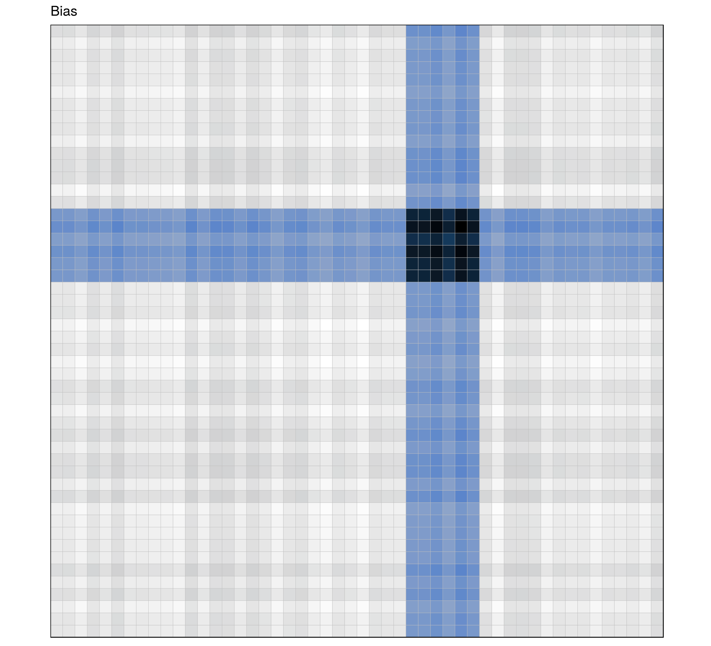
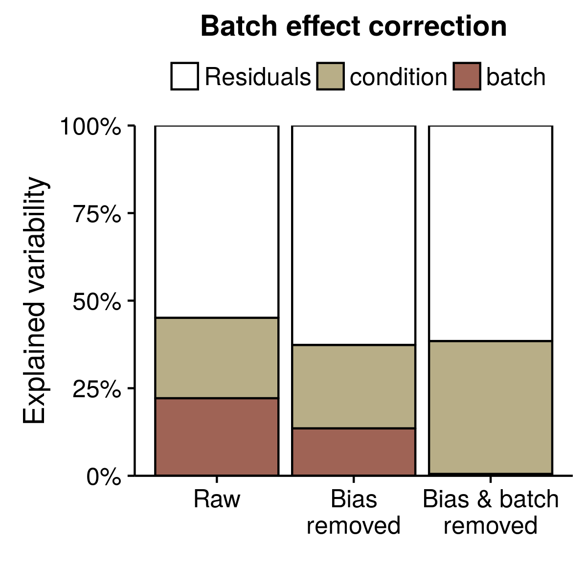

```{r xaringan-themer, include = FALSE}
library("xaringanthemer")
mono_accent(
    base_color = "#143A5C"
	)
#solarized_light()
```


```{r setup, include=FALSE}
options(htmltools.dir.version = FALSE)
htmltools::tagList(rmarkdown::html_dependency_font_awesome())
```

class: inverse, center, middle

# Interrogating genome structure

# Reproducibility and biases

## Münster, 12 July 2018

</br>

### Enrique (Quique) Vidal</br><i class="fa fa-envelope"></i> enrique.vidal@crg.eu

### <i class="fa fa-twitter"></i> @qenvio <i class="fa fa-github"></i> qenvio


---


.pull-left2[
.center[
.theframe[
```{r, echo=FALSE, out.width="80%"}
knitr::include_graphics("images/miguel.JPG")
```
]
]
]
.pull-left2[
.center[
.theframe[
```{r, echo=FALSE, out.width="80%"}

```
]
]
]

.pull-right2[
.center[
.theframe[
```{r, echo=FALSE, out.width="80%"}

```
]
]
]
.pull-right2[
.center[
.theframe[
```{r, echo=FALSE, out.width="80%"}

```
]
]
]

--

.center[
.theframe[
```{r, echo=FALSE, out.width="80%"}

```
]
]


---
count: false

# 4DGenome

.pull-left[
.center[
.theframe[
```{r, echo=FALSE, out.width="90%"}
knitr::include_graphics("images/M_Beato.jpg")
```
]
]
.center[
.theframe[
```{r, echo=FALSE, out.width="90%"}
knitr::include_graphics("images/T_Graff.jpg")
```
]
]
]

.pull-right[
.center[
.theframe[
```{r, echo=FALSE, out.width="90%"}
knitr::include_graphics("images/M_Marti.jpg")
```
]
]
.center[
.theframe[
```{r, echo=FALSE, out.width="90%"}
knitr::include_graphics("images/G_Filion.jpg")
```
]
]
]

---
class: inverse, center, middle
count: false

# Motivation

---

# Genome structure is not random

.center[
.theframe[
```{r, echo=FALSE, out.width="55%"}

```
]
]

---

# Chromosome conformation capture

**Dekker, J. et al. (2002)**</br>
*Capturing chromosome conformation*</br>
Science

--
.center[
.theframe[
```{r, echo=FALSE, out.width="90%"}

```
]
]

--
**Lieberman-Aiden, E. et al. (2009)**</br>
*Comprehensive mapping of long-range interactions reveals folding principles of
the human genome*</br>
Science

---

# Hi-C

.center[
.theframe[
```{r, echo=FALSE, out.width="70%"}
knitr::include_graphics("images/hic_3.png")
```
]
]


---
class: inverse, center, middle
count: false

# What can we get from Hi-C?


---

# Territories

.center[
.theframe[
```{r, echo=FALSE, out.width="70%"}

```
]
]

---

# Compartments

.center[
.theframe[
```{r, echo=FALSE, out.width="70%"}
knitr::include_graphics("images/hic_2.png")
```
]
]

---

# Domains (TADs)

.center[
.theframe[
```{r, echo=FALSE, out.width="70%"}
knitr::include_graphics("images/hic_3.png")
```
]
]

---

# Loops

.center[
.theframe[
```{r, echo=FALSE, out.width="70%"}

```
]
]

---

# In a nutshell

.center[
.theframe[
```{r, echo=FALSE, out.width="70%"}
knitr::include_graphics("images/hic.png")
```
]
]

---

# Distance decay

.center[
.theframe[
```{r, echo=FALSE, out.width="70%"}

```
]
]


---

# Papers

.center[
.theframe[
```{r, echo=FALSE, out.width="70%"}

```
]
]


---
count: false

# Papers

.small[

.pull-left[
**Lieberman-Aiden, E. et al. (2009)**</br>
*Comprehensive mapping of long-range interactions reveals folding principles of
the human genome*</br>
Science

**Yaffe, E. and Tanay, A. (2011)**</br>
*Probabilistic modeling of Hi-C contact maps eliminates systematic biases to
characterize global chromosomal architecture*</br>
Nature genetics

**Imakaev, M. et al. (2012)**</br>
*Iterative correction of Hi-C data reveals hallmarks of chromosome organization*</br>
Nature methods

**Dixon, J. R. et al (2012)**</br>
*Topological Domains in Mammalian Genomes Identified by Analysis of Chromatin
Interactions*</br>
Nature


]

.pull-right[


**Nora, E. P. et al. (2012)**</br>
*Spatial partitioning of the regulatory landscape of the X-inactivation
centre*</br>
Nature


**Rao, S.S. et al. (2014)**</br>
*A 3D map of the human genome at kilobase resolution reveals principles of
chromatin looping*</br>
Cell

**Hug, B. H. (2017)**</br>
*Chromatin architecture emerges during zygotic genome activation independent of
transcription*</br>
Cell

**Stadhouders, R. and Vidal, E. et al (2018)**</br>
*Transcription factors orchestrate dynamic interplay between genome topology and
gene regulation during cell reprogramming*</br>
Naure genetics

]

]

---
class: inverse, center, middle
count: false

# Challenge 1
# Systematic biases

---

# Genomic features affect Hi-C

.center[
.theframe[
```{r, echo=FALSE, out.width="70%"}

```
]
]

.tiny[
**Yaffe, E. and Tanay, A. (2011)**</br>
*Probabilistic modeling of Hi-C contact maps eliminates systematic biases to
characterize global chromosomal architecture*</br>
Nature genetics
]

---

# Illustrating biases

.pull-left[
.center[
.theframe[
```{r, echo=FALSE, out.width="100%"}
knitr::include_graphics("images/toy_signal.png")
```
]
]
]

--
.pull-right[
.center[
.theframe[
```{r, echo=FALSE, out.width="100%"}
knitr::include_graphics("images/toy_feature.png")
```
]
]
]

---
count: false

# Illustrating biases

.pull-left[
.center[
.theframe[
```{r, echo=FALSE, out.width="100%"}
knitr::include_graphics("images/toy_signal.png")
```
]
]
]

.pull-right[
.center[
.theframe[
```{r, echo=FALSE, out.width="100%"}

```
]
]
]

---
count: false

# Illustrating biases

.pull-left[
.center[
.theframe[
```{r, echo=FALSE, out.width="100%"}
knitr::include_graphics("images/toy_signal_and_bias.png")
```
]
]
]

--
.pull-right[
.center[
.theframe[
```{r, echo=FALSE, out.width="100%"}

```
]
]
]

---
count: false

# Illustrating biases

.pull-left[
.center[
.theframe[
```{r, echo=FALSE, out.width="100%"}
knitr::include_graphics("images/toy_signal_and_bias.png")
```
]
]
]

.pull-right[
.center[
.theframe[
```{r, echo=FALSE, out.width="100%"}
knitr::include_graphics("images/toy_decay.png")
```
]
]
]

---
count: false

# Illustrating biases

.pull-left[
.center[
.theframe[
```{r, echo=FALSE, out.width="100%"}
knitr::include_graphics("images/toy_signal_and_bias_and_decay.png")
```
]
]
]

--
.pull-right[
.center[
.theframe[
```{r, echo=FALSE, out.width="100%"}

```
]
]
]

---
count: false

# Illustrating biases

.pull-left[
.center[
.theframe[
```{r, echo=FALSE, out.width="100%"}
knitr::include_graphics("images/toy_signal.png")
```
]
]
]

.pull-right[
.center[
.theframe[
```{r, echo=FALSE, out.width="100%"}

```
]
]
]


---
class: inverse, center, middle
count: false

# Challenge 2
# Reproducibility

---

# Decay drives Hi-C matrix comparison

.pull-left[
.center[
.theframe[
```{r, echo=FALSE, out.width="90%"}

```
]
]
]

--
.pull-right[
- Correct by expected decay **O / E**

- Compute by distance **SCC**

.tiny[**Yang, T. et al. (2017)**</br>
*HiCRep: assessing the reproducibility of Hi-C data using a stratum-adjusted
correlation coefficient*</br>
Genome research
]

- Spectral decomposition **Reproducibility score**

.tiny[**Yan, K. K. et al. (2017)**</br>
*HiC-spector: a matrix library for spectral and reproducibility analysis of Hi-C
contact maps*</br>
Bioinformatics
]
]


---
# Reproducibility

.center[
.theframe[
```{r, echo=FALSE, out.width="70%"}

```
]
]


---
class: inverse, center, middle
count: false

# Challenge 3
# Aberrant karyotypes

---
# Cancer cell line: K562

.center[
.theframe[
```{r, echo=FALSE, out.width="70%"}

```
]
]

---

count: false

# Cancer cell line: T47D

.center[
.theframe[
```{r, echo=FALSE, out.width="70%"}

```
]
]

---
count: false

# Cancer cell line: T47D

.center[
.theframe[
```{r, echo=FALSE, out.width="70%"}

```
]
]

---
class: inverse, center, middle
count: false

# Previous approaches

---

.pull-left[

# HiCNorm

</br>

.center[

Explicit model of biases

Regression model

All matrix entries

]

</br>

.tiny[
**Hu, M. et al. (2012)**</br>
*HiCNorm: removing biases in Hi-C data via Poisson regression*</br>
Bioinformatics
]

.tiny[
**Yaffe, E. and Tanay, A. (2011)**</br>
*Probabilistic modeling of Hi-C contact maps eliminates systematic biases to
characterize global chromosomal architecture*</br>
Nature genetics
]

]

--
.pull-righ[

# ICE

</br>

.center[

Implicit correction

Matrix balancing

Equal visibility

]

</br>

.tiny[
**Imakaev, M. et al. (2012)**</br>
*Iterative correction of Hi-C data reveals hallmarks of chromosome organization*</br>
Nature methods

]

]

---

# In action

.center[
.theframe[
```{r, echo=FALSE, out.width="70%"}

```
]
]


---

.pull-left[

# HiCNorm

</br>

### &#x2713; fewer artifacts

### &#x274C; very slow

### &#x274C; no high resolution


]

.pull-righ[

# ICE

</br>

### &#x274C; more artifacts

### &#x2713; fast

### &#x2713; high resolution

</br>

]

--
.center[

### &#x274C; aberrant karyotypes

]


---
class: inverse

# Wish list

--
### &#9825; Suitable aberrant karyotypes

--
### &#9825; As good as existing

--
### &#9825; Not worse on normal karyotypes

--
### &#9825; Fast

--
### &#9825; Usable at high resolution


---

# 2D &#8594; 1D

--
.center[
.theframe[
```{r, echo=FALSE, out.width="70%"}
knitr::include_graphics("images/hic_2.png")
```
]
]

---

# Totals vs. Genomic features

.center[
.theframe[
```{r, echo=FALSE, out.width="70%"}

```
]
]

---
count: false

# Non-linear relationship


.center[
.theframe[
```{r, echo=FALSE, out.width="70%"}

```
]
]

---

# OneD model

.pull-left[
.center[
.theframe[
```{r, echo=FALSE, out.width="100%"}
knitr::include_graphics("images/hic_2.png")
```
]
]
]

.pull-righ[
</br>
$$t_i = \sum_{j}^{n}{x_{i,j}} \sim NB(\lambda_i, \theta)$$
$$log\left(\lambda_i\right) \propto \sum_{k}{f_k(x_k)}$$
$$\lambda_{i}' = \frac{\lambda_i}{\sum_i^n{\lambda_j}/n}$$
$$\hat{x}_{i,j} = \frac{x_{i,j}}{\sqrt{\lambda_{i}'\lambda_{j}'}}$$
]

---
count: false

# OneD model

.pull-left[
.center[
.theframe[
```{r, echo=FALSE, out.width="100%"}

```
]
]
]

.pull-righ[
</br>
$$t_i = \sum_{j}^{n}{x_{i,j}} \sim NB(\lambda_i, \theta)$$
$$log\left(\lambda_i\right) \propto \sum_{k}{f_k(x_k)}$$
$$\lambda_{i}' = \frac{\lambda_i}{\sum_i^n{\lambda_j}/n}$$
$$\hat{x}_{i,j} = \frac{x_{i,j}}{\sqrt{\lambda_{i}'\lambda_{j}'}}$$
]


---
count: false

# OneD model

.pull-left[
.center[
.theframe[
```{r, echo=FALSE, out.width="100%"}
knitr::include_graphics("images/hic_2.png")
```
]
]
]

.pull-righ[
</br>
$$t_i = \sum_{j}^{n}{x_{i,j}} \sim NB(\lambda_i, \theta)$$
$$log\left(\lambda_i\right) \propto \sum_{k}{f_k(x_k)}$$
$$\lambda_{i}' = \frac{\lambda_i}{\sum_i^n{\lambda_j}/n}$$
$$\hat{x}_{i,j} = \frac{x_{i,j}}{\sqrt{\lambda_{i}'\lambda_{j}'}}$$
]

---

# In action

.center[
.theframe[
```{r, echo=FALSE, out.width="70%"}

```
]
]


---
class: inverse, center, middle
count: false

# OneD performance

---

# Benchmark strategy

### Different methods

Including doing nothing (raw)


### Different protocols

Restriction enzyme, in-situ / diluted, lab, etc ...


### Different cell types

*Spike-in*


---

# Pair-wise comparison

.center[
.theframe[
```{r, echo=FALSE, out.width="70%"}

```
]
]

---

# ROC and AUC

.center[
.theframe[
```{r, echo=FALSE, out.width="70%"}
knitr::include_graphics("images/benchmark_rocs_only2.png")
```
]
]

---
count: false

# ROC and AUC

.center[
.theframe[
```{r, echo=FALSE, out.width="70%"}

```
]
]

---
count: false

# ROC and AUC

.center[
.theframe[
```{r, echo=FALSE, out.width="70%"}

```
]
]

---
class: inverse

# Wish list

### &#9825; Suitable aberrant karyotypes &#x2713;

### &#9825; ~~As good as~~ Better than existing &#x2713;

### &#9825; Not worse on normal karyotypes

### &#9825; Fast

### &#9825; Usable at high resolution

---

# ROC and AUC (diploid)

.center[
.theframe[
```{r, echo=FALSE, out.width="70%"}

```
]
]

---
class: inverse

# Wish list

### &#9825; Suitable aberrant karyotypes &#x2713;

### &#9825; Better than existing &#x2713;

### &#9825; Not worse on normal karyotypes &#x2713;

### &#9825; Fast

### &#9825; Usable at high resolution

---

# Speed

.center[
.theframe[
```{r, echo=FALSE, out.width="70%"}

```
]
]

---
class: inverse

# Wish list

### &#9825; Suitable aberrant karyotypes &#x2713;

### &#9825; Better than existing &#x2713;

### &#9825; Not worse on normal karyotypes &#x2713;

### &#9825; Fast  &#x2713;

### &#9825; Usable at high resolution

---

# Resolution

.center[
.theframe[
```{r, echo=FALSE, out.width="70%"}

```
]
]

---
class: inverse

# Wish list

### &#9825; Suitable aberrant karyotypes &#x2713;

### &#9825; Better than existing &#x2713;

### &#9825; Not worse on normal karyotypes &#x2713;

### &#9825; Fast &#x2713;

### &#9825; Usable at high resolution &#x2713;

---

# Resolution (with some tricks)

--
.pull-left[
.center[
.shadow[
```{r, echo=FALSE, out.width="90%"}

```
]
]
.center[.large[Less data, less time]]
]

--
.pull-left[
.center[
.shadow[
```{r, echo=FALSE, out.width="90%"}

```
]
]
.center[.large[Less data, same performance]]
]

---
class: inverse

# Summary

</br>

--
### Hi-C can interrogate genome structure

### Hi-C experiments have biases (including copy number)

</br>

--
### OneD removes biases increasing reproducibility 

### OneD is fast and suitable at high resolutions

---

# OneD availability

### R package

https://github.com/qenvio/dryhic


### Paper

**Vidal, E. et al. (2018)**

*OneD: increasing reproducibility of Hi-C samples
with abnormal karyotypes*

Nucleic acids research

https://doi.org/10.1093/nar/gky064

---
class: inverse, center, middle

# The inner life of TADs

### Genome-wide enrichment of contacts between regions

(i.e. promoters and enhancers)

---

# Types of bins inside a TAD

.center[
.shadow[
```{r, echo=FALSE, out.width="60%"}
knitr::include_graphics("images/intratad_cartoon.png")
```
]
]

---

# Example: HCR and H3K4me3

--
.pull-left[
.center[
.shadow[
```{r, echo=FALSE, out.width="80%"}
knitr::include_graphics("images/intratad_cartoon.png")
```
]
]
]

--
.pull-right[
.center[
.shadow[
```{r, echo=FALSE, out.width="80%"}
knitr::include_graphics("images/intratad_raw_onebatch.png")
```
]
]
]

</br>

.small[
**Le Dily, F. and Vidal, E. et al. (2017)**</br>
*Hormone Control Regions mediate opposing steroid receptor-dependent genome
organizations*</br>
bioRxiv</br>
https://doi.org/10.1101/233874
]


---

# Summarizing via linear mixed model

.pull-left[
.center[
.shadow[
```{r, echo=FALSE, out.width="80%"}
knitr::include_graphics("images/intratad_raw_onebatch.png")
```
]
]
]

--
.pull-right[
.center[
.shadow[
```{r, echo=FALSE, out.width="80%"}
knitr::include_graphics("images/intratad_linearmodel_onebatch.png")
```
]
]
$$log2\left(\frac{O_{ijk}}{E_{ijk}}\right) \sim N(\mu_{ijk}, \sigma)$$
$$\mu_{ijk}=\pi_i+\rho_j+\delta_{ij}+\tau_k$$
$$\tau_{k} \sim N(\mu_{tad}, \sigma_{tad})$$
]

---

# Simple comparison

.pull-left[
.center[
.shadow[
```{r, echo=FALSE, out.width="80%"}
knitr::include_graphics("images/intratad_linearmodel_onebatch.png")
```
]
]
]

--
.pull-right[
.center[
.shadow[
```{r, echo=FALSE, out.width="80%"}

```
]
]
]

---

# More samples

.center[
.shadow[
```{r, echo=FALSE, out.width="60%"}

```
]
]

---

# Even more samples (replicates!)

.center[
.shadow[
```{r, echo=FALSE, out.width="60%"}
knitr::include_graphics("images/intratad_linearmodel_foldchange_timepoints_replicates.png")
```
]
]

---

# Do we have batch effect?

--
.center[
.shadow[
```{r, echo=FALSE, out.width="60%"}

```
]
]


---

# Removing biases helps ...

.center[
.shadow[
```{r, echo=FALSE, out.width="60%"}

```
]
]

---

# ... and removing batch effect is even better

.center[
.shadow[
```{r, echo=FALSE, out.width="60%"}
knitr::include_graphics("images/intratad_batch_pca_batch.png")
```
]
]

---

# Total variance explained

--
.center[
.shadow[
```{r, echo=FALSE, out.width="60%"}

```
]
]

---
class: inverse

# Grand summary

</br>

--
### Genome structure plays a role and can be measured

--

### Increasing production of Hi-C data

--

### Methodological challenges to analyze and integrate Hi-C data

--

</br>
.center[
### OneD: <i class="fa fa-github"></i> qenvio/dryhic
]


---
class: inverse, center, middle
count: false

---
class: inverse, center, middle
count: false

# OneD extras

---
count: false

# Incomplete designs

.center[
.shadow[
```{r, echo=FALSE, out.width="100%"}

```
]
]

---
count: false

# Copy number estimation


.center[
.shadow[
```{r, echo=FALSE, out.width="70%"}

```
]
]


---
count: false

# Precision-Recall

.center[
.shadow[
```{r, echo=FALSE, out.width="100%"}

```
]
]

---
count: false

# Precision-Recall

.center[
.shadow[
```{r, echo=FALSE, out.width="50%"}

```
]
]


